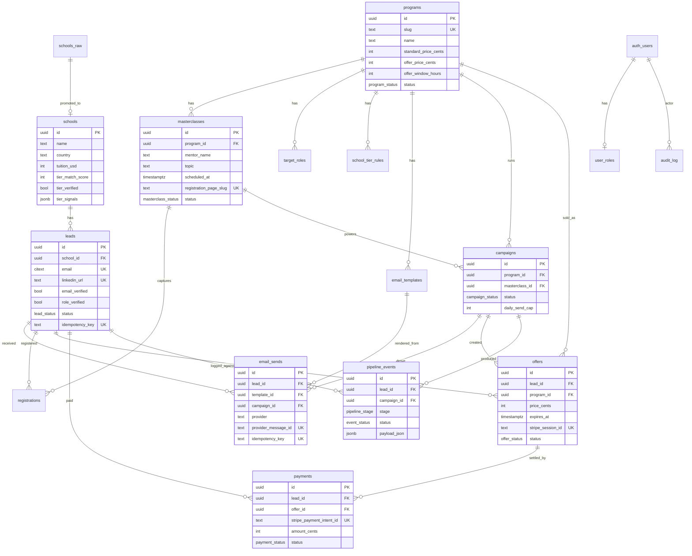

# Database schema (ER diagram)

> Phase 1 deliverable. SQL is in `packages/db/migrations/0001_init.sql` + `0002_rls.sql`. Seed is in `packages/db/seed.sql`.

## Mermaid ER diagram

## Key constraints

- `leads.idempotency_key` is unique — every external upsert path computes this from `(program_id, source, email)` so re-running enrichment never duplicates.
- `email_sends.idempotency_key` is unique — every send computes from `(lead_id, template_id, campaign_id)` so retried sends don't double-mail.
- `payments.stripe_payment_intent_id` is unique — Stripe webhook is naturally idempotent.
- `offers.stripe_session_id` is unique — enforces 1:1 with the Checkout session.
- `schools.website` is unique (case-insensitive) — same school across two seed sources collapses.
- `registrations(lead_id, masterclass_id)` is unique — re-registering the same lead is a no-op.

## Funnel view

`public.campaign_funnel` joins `campaigns → email_sends → registrations → offers → payments` and exposes:

`emails_sent · opened · clicked · registered · attended · offered · paid · revenue_cents`

The dashboard in Phase 8 reads from this view; no application-side aggregation. This is what makes "every funnel number answerable in <30s" honest.
